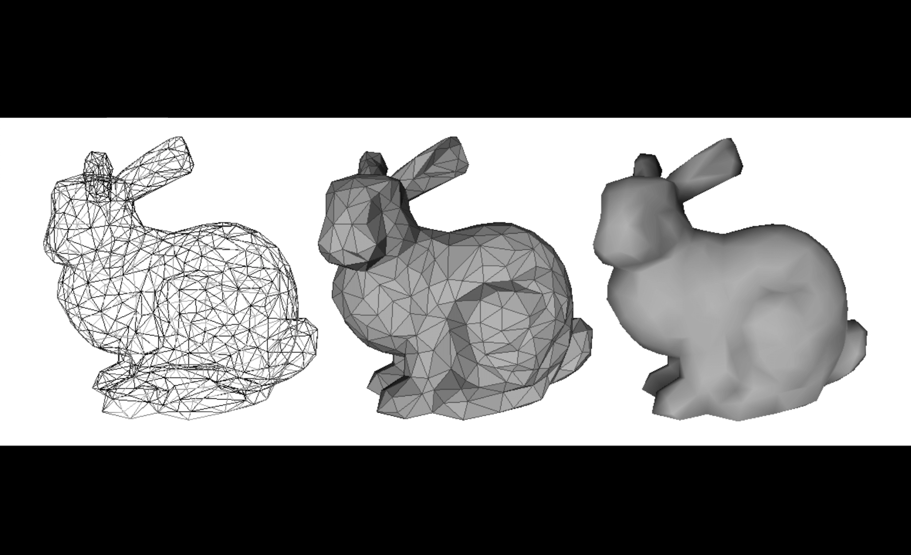

3D Scene Editor
===============

A 3D editor that allows to prepare 3D scenes composed of multiple3D objects.

Interactive application that allows user to add, edit, and delete 3D meshes. A few default objects are provided, and can be added to the scene in three ways:

- The key <kbd>1</kbd> will add a unit cube in the origin. 

- The key <kbd>2</kbd> will import a new copy of the mesh `bumpy_cube.off`, scale it to fit into a unit cube and center it on the origin.

- The key <kbd>3</kbd> will import a new copy the mesh `bunny.off`, scale it to fit into a unit cube and center it on the origin.

3 Rendering Modes:
--------------------

1. **Wireframe**: only the edges of the triangles are drawn.

2. **Flat Shading**: each triangle is rendered using a unique color (i.e. the normal of all the fragments that compose a triangle is simply the normal of the plane that contains it). On top of the flat shaded triangle, you should draw the wireframe.

3. **Phong Shading**: the normals are specified on the vertices of the mesh and interpolated in the interior. The lighting equation should be evaluated for each fragment.

To compute the per-vertex normals we first compute the per-face normals, and then average them on the neighboring vertices. In other words, the normal of the vertex of a mesh is  the average of the normals of the faces touching it. 

Object Selection
--------------------
Clicking on a object will select the object, changing its color.

Note that, because vertex coordinates are transformed by a different object matrix **M** in the vertex shader (from object space to world space), we compute the ray parameter **(e, d)** in the canonical viewing volume (same as the world space for this exercise),transform the parameters by **M-1**,  compute the intersection in object space, and then transform back the intersection point from the object space to the world space.

Object Control 
--------------------

All transformations are be done in the shader. The VBO containing the vertex positions of each object is uploaded only once to the GPU.

When an object is selected, it should be possible to translate it, rotate it around its barycenter, and rescale it without changing its barycenter.
